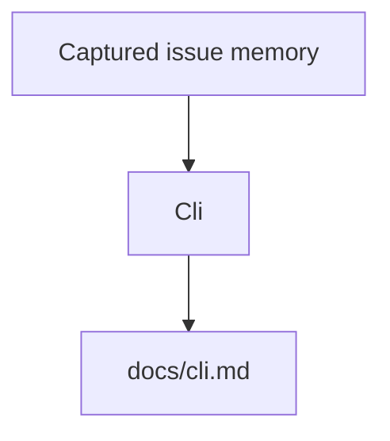

# Cli

<!-- BEGIN OPENSYMPHONY MANAGED MEMORY SYNC -->

## Current model

- COE-284 contributed: PR #47: Add installable opensymphony run command (merge `51821f0`)

## Important invariants

- Preserve the behavior described in the recent captured changes unless current code and tests show it has changed.
- Use capsule source refs to inspect the original PR or Linear issue when context is ambiguous.

## Operational flow

## Known gotchas

- No area-specific gotchas were inferred from the selected memory.

## Recent changes

- COE-284: Add orchestrator run command to CLI and make it installable

## Source refs

- COE-284

<!-- END OPENSYMPHONY MANAGED MEMORY SYNC -->
