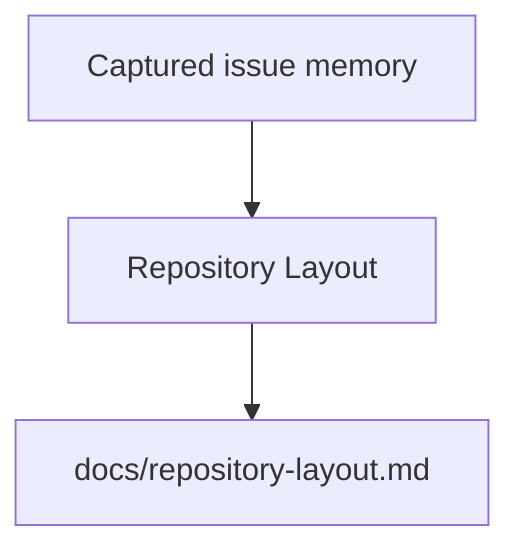

# Repository Layout

This document records the intended package, module, and directory ownership for
the OpenSymphony implementation repo.

## 1. Top-level layout

```text
OpenSymphony/
  AGENTS.md
  README.md
  WORKFLOW.example.md
  Cargo.toml
  crates/
  docs/
  examples/
  scripts/
  tools/
  .github/
```

`Cargo.toml` at the repository root is the only Cargo package manifest.

OpenSymphony publishes one crates.io package, `opensymphony`.

The `crates/opensymphony-*` directories remain because they are useful internal
subsystem boundaries, but they are source directories compiled into the main
package, not standalone published crates.

## 2. Internal subsystem boundaries

### `opensymphony_domain`

- shared domain types
- scheduler state and transitions
- snapshot models

### `opensymphony_workflow`

- `WORKFLOW.md` loading
- typed front-matter resolution
- strict prompt rendering
- environment and path resolution
- migration errors for removed workflow fields

### `opensymphony_workspace`

- workspace path resolution
- containment and sanitization
- lifecycle hooks
- issue and conversation manifests

### `opensymphony_linear`

- Linear GraphQL read adapter
- pagination and normalization
- tracker reconciliation helpers
- guarded operator-side issue archival for memory cleanup

### `opensymphony_memory`

- issue capsule generation
- DuckDB memory index and markdown indexes
- memory search, related-context lookup, and compact briefs
- docs sync planning and public/private link checks
- archive eligibility checks

### `opensymphony_openhands`

- local server supervision
- REST client
- WebSocket event stream
- issue session runner

### `opensymphony_orchestrator`

- scheduler loop
- retry queue
- reconciliation
- worker supervision

### `opensymphony_control`

- control-plane HTTP API
- snapshot publication

### `opensymphony_cli`

- `init`
- `run`
- `debug`
- `memory`
- `linear archive`
- `daemon`
- `tui`
- `doctor`
- `rehydrate`

### `opensymphony_tui`

- FrankenTUI operator UI

### `opensymphony_testkit`

- fake OpenHands helpers
- fake Linear fixtures
- contract-test utilities

## 3. Shared non-module assets

### `tools/openhands-server/`

Owns the pinned local OpenHands package and launch scripts that the published
CLI embeds for `opensymphony install openhands`.

### `examples/`

Holds sample configs and target-repo fixtures.

### `docs/`

Owns design, operations, and migration documentation.

### `.agents/skills/` in the template repo

Owns target-repo agent guidance. The most important Linear assets now live in
the template skill tree instead of a separate bridge crate:

- `SKILL.md`
- `scripts/linear_graphql.py`
- `queries/*.graphql`
- `references/*.md`

## 4. Template skill propagation rule

`opensymphony init` and `opensymphony update` must copy `.agents/skills/`
recursively so that target repos receive the complete skill payload, including
helper scripts and query assets.

That rule is now part of the supported public behavior.

## 5. Versioning note

OpenSymphony `1.0.0` removed the old agent-side Linear bridge layer. The
internal module layout above is the post-removal structure and should stay free
of dead bridge code.

<!-- BEGIN OPENSYMPHONY MANAGED MEMORY SYNC -->

## Current model

- COE-280 contributed: PR #54: Support workflow-owned OpenHands runtime overrides (merge `5663898`)
- COE-281 contributed: PR #55: COE-281: support path-prefixed OpenHands URLs and MCP config (merge `a50e435`)
- COE-282 contributed: PR #52: Support workflow-owned OpenHands conversation reuse policy at runtime (merge `ad111a3`)
- COE-287 contributed: PR #48: Add opensymphony debug command for issue conversations (merge `021f5ad`)
- COE-294 contributed: PR #58: COE-294: detect LLM config drift and rehydrate conversations (merge `5ab7015`)

## Important invariants

- Preserve the behavior described in the recent captured changes unless current code and tests show it has changed.
- Use capsule source refs to inspect the original PR or Linear issue when context is ambiguous.

## Operational flow



## Known gotchas

- No area-specific gotchas were inferred from the selected memory.

## Recent changes

- COE-280: Support workflow-owned OpenHands auth, provider, and launcher overrides at runtime
- COE-281: Support path-bearing OpenHands base URLs and MCP config at runtime
- COE-282: Support workflow-owned OpenHands conversation reuse policy at runtime
- COE-287: Add opensymphony debug command for conversational session debugging
- COE-294: Detect LLM config changes and rehydrate conversations with updated env vars

## Source refs

- COE-280
- COE-281
- COE-282
- COE-287
- COE-294

<!-- END OPENSYMPHONY MANAGED MEMORY SYNC -->
