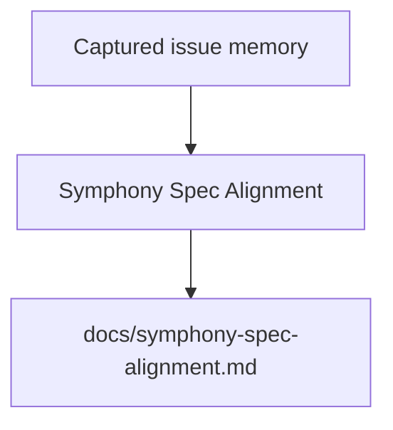

# Symphony Spec Alignment

This document maps the upstream Symphony specification onto the OpenSymphony implementation.

## 1. Upstream position

Symphony is a service specification, not a language binding. The upstream repository explicitly presents "make your own" as an option and treats the Elixir code as an experimental reference implementation.

OpenSymphony therefore aims to be:

- faithful to the upstream design
- explicit about its OpenHands-specific extensions
- conservative where the spec is strict
- honest where implementation choices go beyond the minimum

## 2. Section mapping

## 2.1 Problem statement and goals

Upstream intent:

- long-running automation service
- issue tracker polling
- isolated workspace per issue
- coding-agent execution inside that workspace
- operator-visible observability

OpenSymphony mapping:

- the internal `opensymphony_orchestrator` module owns the daemon workflow
- the internal `opensymphony_linear` module implements Linear polling and reconciliation
- the internal `opensymphony_workspace` module enforces per-issue workspace invariants
- the internal `opensymphony_openhands` module adapts OpenHands conversation execution
- the internal `opensymphony_control` and `opensymphony_tui` modules provide optional visibility

## 2.2 Main components

Upstream component | OpenSymphony internal module
--- | ---
Workflow Loader | `opensymphony_workflow`
Config Layer | `opensymphony_workflow` + `opensymphony_domain`
Issue Tracker Client | `opensymphony_linear`
Orchestrator | `opensymphony_orchestrator`
Workspace Manager | `opensymphony_workspace`
Agent Runner | `opensymphony_openhands`
Status Surface | `opensymphony_control` + `opensymphony_tui`
Logging | shared tracing/logging setup

## 2.3 Domain model

OpenSymphony preserves the major Symphony runtime entities:

- normalized issue record
- run attempt
- retry entry
- issue execution state and transition rules
- workspace record
- runtime snapshot

Implementation note:

- the shared scheduler state machine lives in `opensymphony_domain` so downstream subsystems can consume one stable model
- the agent-specific fields refer to OpenHands concepts instead of Codex fields
- OpenSymphony adds conversation metadata such as `conversation_id`, `server_base_url`, `stream_state`, and `last_event_id`

## 2.4 `WORKFLOW.md`

Preserved exactly:

- repository-root `WORKFLOW.md`
- YAML front matter plus Markdown body
- Markdown body preserved verbatim after the front matter delimiter
- strict rendering
- `issue` object available to the template
- `attempt` available to the template for retry or continuation metadata

OpenSymphony extension:

- `openhands` namespace in front matter for runtime-specific settings
- unknown top-level front matter namespaces are rejected instead of ignored

## 2.5 Orchestration state machine

Preserved exactly:

- `Unclaimed`
- `Claimed`
- `Running`
- `RetryQueued`
- `Released`

Preserved behaviors:

- normal worker exit schedules short continuation retry
- failure exit uses exponential backoff
- reconciliation can cancel work if issue state changes
- terminal issues can trigger workspace cleanup

Implementation note:

- OpenHands `execution_status` does not replace the Symphony state machine
- it is only one input into the worker-outcome classification

## 2.6 Workspace requirements

Preserved exactly:

- path shape `<workspace.root>/<sanitized_issue_identifier>`
- sanitized identifier replaces non `[A-Za-z0-9._-]` with `_` and rewrites dot-only results so the
  final workspace key remains one normal path component
- `cwd == workspace_path` invariant
- workspace path must remain under workspace root
- create or reuse semantics
- lifecycle hooks

OpenSymphony addition:

- `.opensymphony/` metadata directory inside each issue workspace
- persisted conversation metadata and generated issue context files

## 2.7 Agent runner contract

Upstream requirement:

- create workspace
- render prompt
- launch coding-agent app-server client
- stream updates to orchestrator
- define integration if the protocol is different

OpenSymphony mapping:

- create or attach to an OpenHands conversation via REST
- stream events via WebSocket
- send prompts as conversation events
- trigger runs via REST
- mirror updates into orchestrator state

This is the main integration substitution relative to the reference implementation.

## 2.8 Retry and backoff

Preserved exactly:

- normal continuation retry: fixed 1000 ms
- failure-driven retry: `min(10000 * 2^(attempt - 1), max_retry_backoff_ms)`

Implementation note:

- the worker may still perform multiple in-process turns before it exits
- `attempt` is a worker-lifetime concept, not a per-OpenHands-event concept

## 2.9 Reconciliation

Preserved exactly:

- active runs are rechecked every poll tick
- terminal state stops work and can clean workspace
- non-active, non-terminal state stops work without cleanup
- stall detection forces retry
- startup cleanup can sweep terminal-state workspaces

OpenSymphony addition:

- runtime-stream reconciliation after WebSocket attach and reconnect using OpenHands `/events/search`

This does not replace Symphony reconciliation. It complements it.

## 2.10 Optional human-readable status surface

Preserved exactly:

- optional
- driven from orchestrator state
- not required for correctness

OpenSymphony mapping:

- `opensymphony_control` publishes a snapshot and event stream
- FrankenTUI renders that snapshot

## 3. OpenSymphony-specific extensions

These are deliberate, documented implementation choices.

### 3.1 `openhands` config namespace

The workflow schema adds an `openhands` namespace for:

- transport configuration
- local server launch configuration
- conversation persistence settings
- WebSocket settings
- repo-local GraphQL helper assets for agent-side Linear operations
- minimal agent payload settings
- extension settings resolved separately from the core workflow config so non-runtime code can stay OpenHands-agnostic
- the repo-local `codex` namespace can coexist as non-runtime metadata, while other unknown top-level namespaces still fail deterministically

### 3.2 Persistent conversation per issue

The minimum spec requires live thread reuse within a worker lifetime. OpenSymphony extends this to reuse one conversation across worker lifetimes for the same issue by default.

Rationale:

- better continuity for long-running issue work
- clean mapping onto OpenHands conversation persistence
- easier restart recovery

### 3.3 Control-plane API

The spec allows any optional status surface. OpenSymphony standardizes on a small local control plane so the UI and future tools can read the same state model.

### 3.4 Workspace-generated context

OpenSymphony writes generated context files under `.opensymphony/` inside each issue workspace. These files are additive and must never overwrite repository-owned `AGENTS.md`.

## 4. Important non-alignments to avoid

Do not make these mistakes:

- Do not replace Symphony polling with only WebSockets.
- Do not let OpenHands server state become the scheduler source of truth.
- Do not treat the OpenHands web-app API as the runtime contract.
- Do not require FrankenTUI for debugging or recovery.
- Do not let agent-side Linear writes become required for orchestration correctness.

## 5. Practical reading order for implementers

1. Upstream `SPEC.md`
2. `docs/architecture.md`
3. `docs/openhands-agent-server.md`
4. `docs/websocket-runtime.md`
5. `docs/workspace-and-lifecycle.md`
6. relevant task file in `docs/tasks/`

<!-- BEGIN OPENSYMPHONY MANAGED MEMORY SYNC -->

## Current model

- COE-280 contributed: PR #54: Support workflow-owned OpenHands runtime overrides (merge `5663898`)
- COE-281 contributed: PR #55: COE-281: support path-prefixed OpenHands URLs and MCP config (merge `a50e435`)
- COE-282 contributed: PR #52: Support workflow-owned OpenHands conversation reuse policy at runtime (merge `ad111a3`)
- COE-287 contributed: PR #48: Add opensymphony debug command for issue conversations (merge `021f5ad`)
- COE-294 contributed: PR #58: COE-294: detect LLM config drift and rehydrate conversations (merge `5ab7015`)

## Important invariants

- Preserve the behavior described in the recent captured changes unless current code and tests show it has changed.
- Use capsule source refs to inspect the original PR or Linear issue when context is ambiguous.

## Operational flow

## Known gotchas

- No area-specific gotchas were inferred from the selected memory.

## Recent changes

- COE-280: Support workflow-owned OpenHands auth, provider, and launcher overrides at runtime
- COE-281: Support path-bearing OpenHands base URLs and MCP config at runtime
- COE-282: Support workflow-owned OpenHands conversation reuse policy at runtime
- COE-287: Add opensymphony debug command for conversational session debugging
- COE-294: Detect LLM config changes and rehydrate conversations with updated env vars

## Source refs

- COE-280
- COE-281
- COE-282
- COE-287
- COE-294

<!-- END OPENSYMPHONY MANAGED MEMORY SYNC -->
